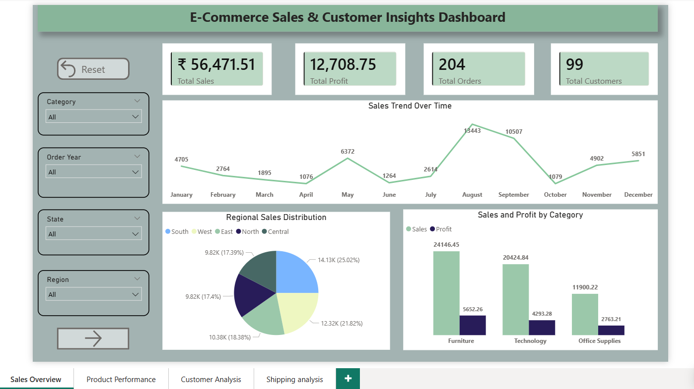
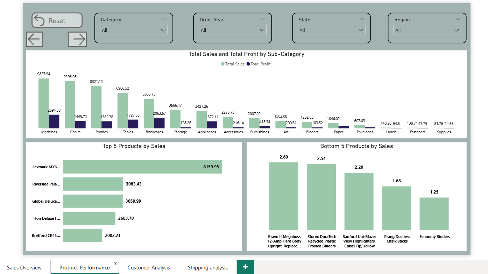
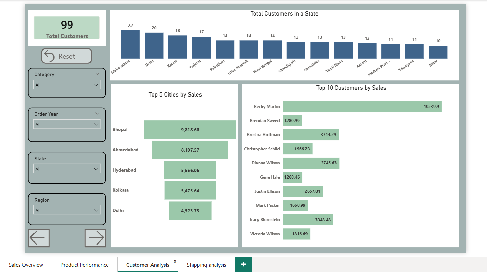
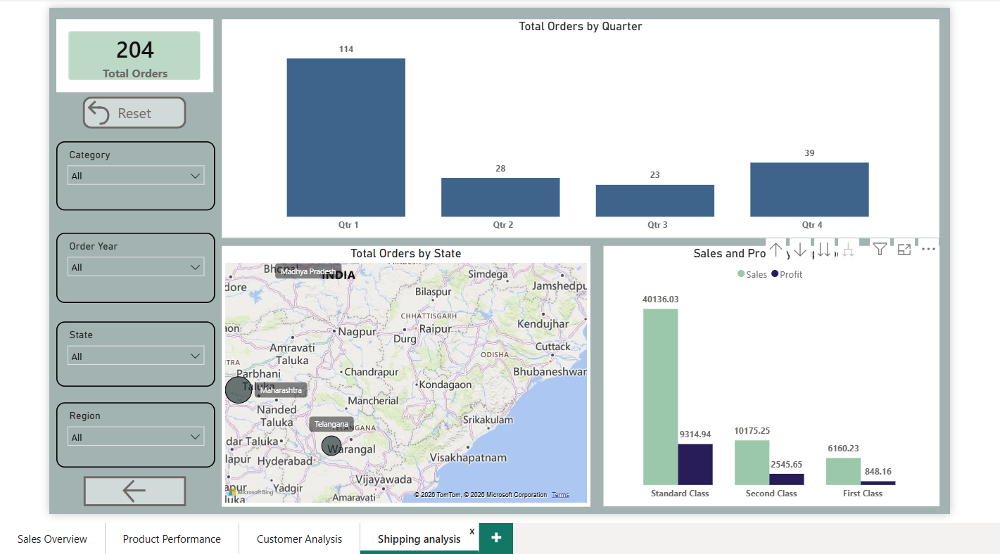

# E-Commerce Sales and Customer Insights Dashboard
## Project Overview
This project presents an interactive Power BI dashboard designed to analyze and visualize e-commerce sales data. The dashboard transforms raw transactional data into meaningful business insights, helping organizations understand sales performance, customer behavior, product trends, and regional demand. The dashboard enables users to explore key business metrics using dynamic filters and visualizations, supporting better decision-making and strategic planning.

## Problem Statement
Modern e-commerce businesses generate large volumes of transactional data, including product sales, customer purchases, regional performance, and shipping information. However, raw sales data alone does not provide clear insights for business decision-making. Organizations need an interactive system to monitor key business metrics such as sales performance, profit trends, customer purchasing behavior, product performance, and regional demand patterns. The challenge is to transform large, unstructured sales data into clear and actionable insights that decision-makers can use to improve revenue, optimize product strategies, and understand market demand. Therefore, the objective of this project is to develop an interactive Power BI dashboard that analyzes e-commerce sales data and presents meaningful insights through dynamic visualizations, enabling businesses to make data-driven decisions.

## Project Objectives
The key objectives of this project are:
- Analyze overall sales and profit performance
- Identify top-performing and low-performing products
- Understand customer purchasing patterns
- Examine regional sales distribution
- Track monthly and yearly sales trends
- Present business insights through interactive visualizations

## Tools and Technologies Used
- Power BI Desktop
- Power Query (Data Cleaning)
- DAX (Data Analysis Expressions)
- CSV Dataset
- Data Visualization Techniques

## Dashboard Features
The dashboard includes several interactive components such as:
### KPI Cards (Key performance indicators):
- Total Sales
- Total Profit
- Total Orders
- Total Customers
### Sales Trend Analysis
Line charts displaying monthly and yearly sales performance.
### Product Performance
Bar charts highlighting top-performing product categories and sub-categories.
### Regional Sales Distribution
Visualizations showing sales performance across different regions.
### Customer Analysis
Insights into purchasing patterns and order distribution.
### Interactive Filters
Users can filter data based on:
- Region
- Category
- Order Year
- State

## Key Insights## Key Insights
- Standard Class shipping contributes the highest sales and profit.
- Furniture category generates the highest sales among all categories.
- Certain cities such as Bhopal and Ahmedabad contribute significantly to revenue.
- A small group of customers accounts for a large portion of total sales.

## Dashboard Preview
### 1. Sales Overview

The Sales Overview dashboard provides a high-level summary of the overall performance of the e-commerce business.
This page includes key performance indicators such as:
- Total Sales: ₹56,471.51
- Total Profit: ₹12,708.75
- Total Orders: 204
- Total Customers: 99
A monthly sales trend chart shows how revenue changes throughout the year, helping identify peak sales months and seasonal demand patterns. The regional sales distribution chart highlights how different regions contribute to overall sales, while the category-wise sales and profit comparison allows businesses to evaluate which product categories generate the highest revenue and profit. Interactive filters for Category, Year, State, and Region allow users to dynamically explore the data.

### 2. Product Performance

The Product Performance dashboard focuses on analyzing how different products and sub-categories contribute to sales and profitability.
Key insights from this page include:
- Sales and profit comparison across product sub-categories
- Identification of the top 5 products by sales
- Identification of the bottom 5 products by sales
This analysis helps businesses identify high-performing products that drive revenue and underperforming products that may require pricing, marketing, or inventory adjustments.

### 3. Customer Analysis

The Customer Analysis dashboard provides insights into customer distribution and purchasing behavior.
Key components include:
- Total number of customers: 99
- Customer distribution by state, showing which regions have the highest number of customers
- Top 5 cities by sales, indicating the cities generating the most revenue
- Top 10 customers by sales, highlighting customers who contribute significantly to overall revenue
These insights help businesses understand their most valuable customers and key markets.

### 4. Shipping Analysis

The Shipping Analysis dashboard focuses on order distribution and shipping performance.
This page includes:
- Total orders: 204
- Orders distribution by quarter, helping analyze seasonal order patterns
- Orders distribution by state, visualized through a geographic map
- Sales and profit comparison by shipping class, including Standard Class, Second Class, and First Class
This analysis helps businesses evaluate shipping methods and understand how logistics impact sales and profitability.

## Business Impact
This dashboard helps businesses:
- Monitor sales performance efficiently
- Identify profitable products and regions
- Understand customer purchasing behavior
- Support data-driven strategic decisions

## Author
Shilam Sai Bhargavi
Aspiring Data Analyst
